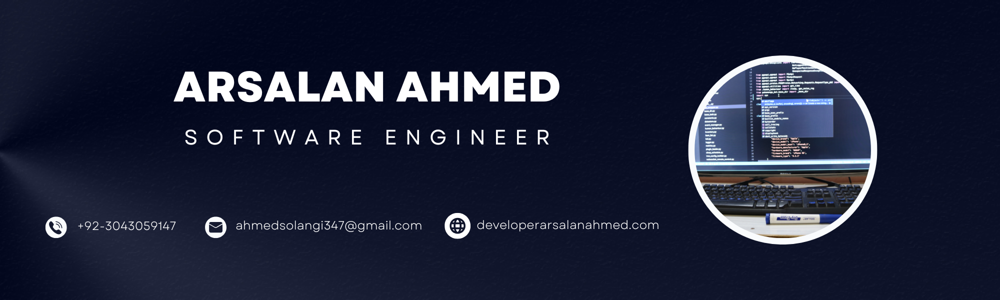
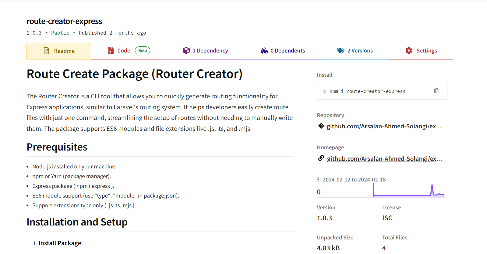

  

    
  

  <h3 align="center">Passionate Software Engineer | Full-Stack Developer | Innovator</h3>  
  <h3 align="center">🧠 My mind operates in computational logic, where algorithms define my vernacular.</h3>
  
  
👨‍💻 Explore My Work: <a href="https://developerarsalanahmed.com" target="_blank">developerarsalanahmed.com</a>
    
  🌟 New on Fiverr: Open for Freelance Projects    
  📱 Google Play Developer: SmartLearningApps    
  🏆 50+ Projects Completed | Collaborated with National & International Clients    
  ⌨️ 1000+ Hours of Coding | 50+ GitHub Repositories  

💡 <strong>Tech Stack & Expertise:</strong>    
 📱 Application Development: Android Native (Java)    
 🚀 Web Development: Next.js, Node.js, Express, React, Laravel, PHP, Web 3, Python    
 📊 Database: MySQL, AWS RDS, MongoDB, PostgreSQL    
 🔐 InfoSec Enthusiast | DevOps & Cloud Computing    
 🤝 Open to Collaboration on Open Source Projects  
⚡ Fun Fact: I love writing code, solving problems, and learning new technologies at lightning speed! 🚀

## 🏆Awards & Achievements

🏅 1st Position Silver Medalist – BS in Software Engineering
🥇 Innovative Idea Award (2023) – Recognized for developing an AI-based Geographic Information System (GIS) with an automated routing algorithm at Salesflo.(GIS) with an automated routing algorithm at Salesflo as a Software Engineer.    
 🥇 Agile Award (2024) – Honored for efficiently meeting customer needs and delivering high-quality solutions as a Senior Software Engineer  

## 🌐Socials

    

# 💻Tech Stack

                                          

## 📦 NPM Packages

### [Route Creator Express](https://www.npmjs.com/package/route-creator-express)

  

    
  

**Description:** The Router Creator is a CLI tool that allows you to quickly generate routing functionality for Express applications, similar to Laravel's routing system. It helps developers easily create route files with just one command, streamlining the setup of routes without needing to manually write them. The package supports ES6 modules and file extensions like .js, .ts, and .mjs.

# 📊GitHub Stats & 🏆GitHub Trophies:

  

    
    
  

  

    
        
  

  <!-- # 📊GitHub Stats :

   
   
  

  ## 🏆GitHub Trophies

   -->

### ✍️Random Dev Quote

---

